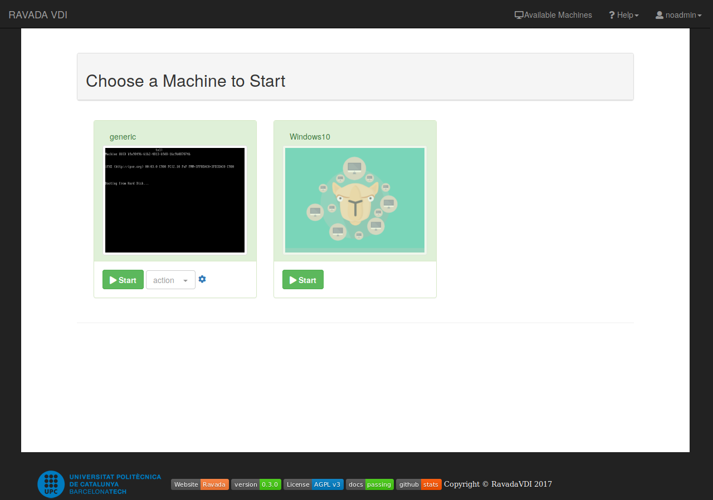
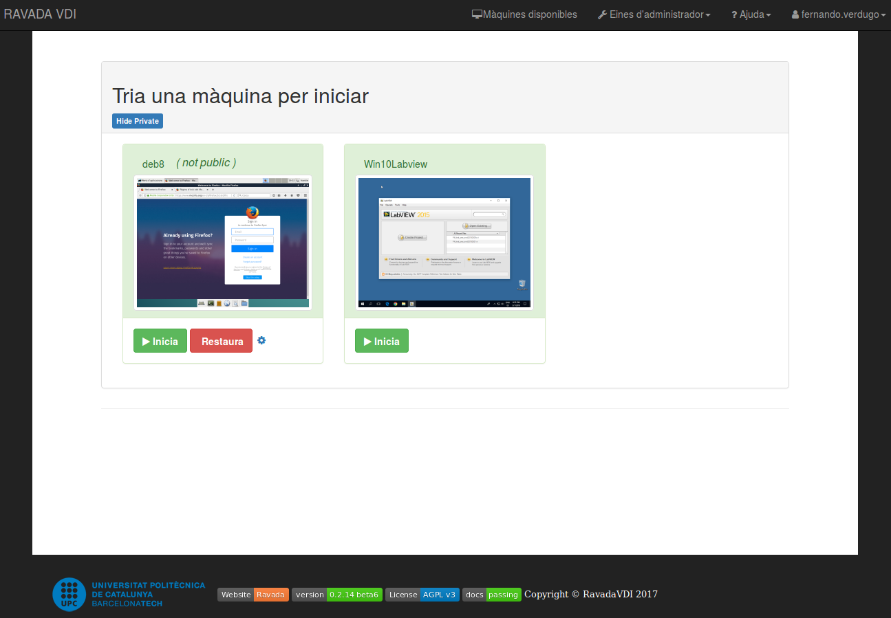
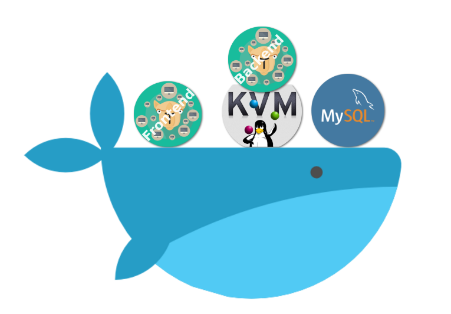

* Dockers

### user role
Rol user

---
### admin role

Rol admin

---
<!-- .slide: data-background-color="#E8F3E8" -->
dockers
---

docker-compose
docker-compose

---
  <asciinema-player src="/279409.cast" cols="125" rows="45"></asciinema-player>
  

---
ñkñklñ